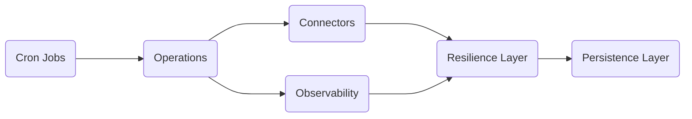
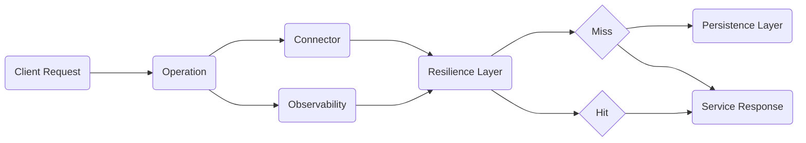

# Documentation

## Summary
- [Description](#description)
- [Installation](#installation)
- [Usage](#usage)
  - [Configuration](#configuration)
  - [API Endpoint](#api-endpoint)
  - [Specify Environment](#specify-environment)

---

# Description

`pricelab-retriever` is a microservice within the PriceLab ecosystem.

It is a configurable and resilient data retrieval service designed to fetch financial market data from heterogeneous data sources. The service operates using YAML-defined configurations and use cases, enabling dynamic orchestration of data ingestion workflows.

## Core Features

- Multi-source data fetching
- Scheduling use cases
- Extensible operation pipeline

---

# Installation

... TBD

---

# Usage

## Configuration

See the parent repository for more information about how to configure the microservice: [here](https://github.com/s-toufik/pricelab-core/blob/develop/Readme.md#microservice-configuration)

---

## API Endpoint

The API endpoint swagger UI is available at: [here](http://localhost:8000/docs)

---

## Start the Service

... TBD

---

## Specify Environment

see [here](https://github.com/s-toufik/pricelab-core/blob/develop/Readme.md#microservice-configuration) the environment variables description.

```bash
export APP_ENV=dev
export CONFIGURATION_DIR=./config
...
```

---

## Example Execution Flow

### Workflow: Cron Jobs



### Workflow: Client Request
